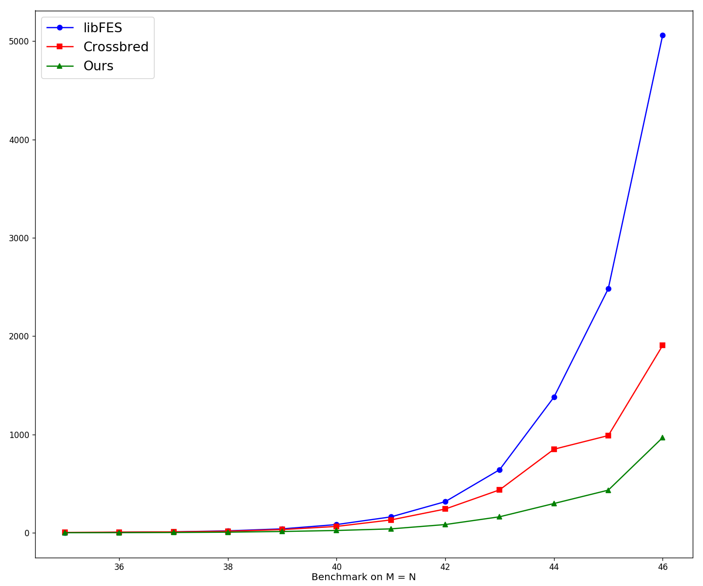
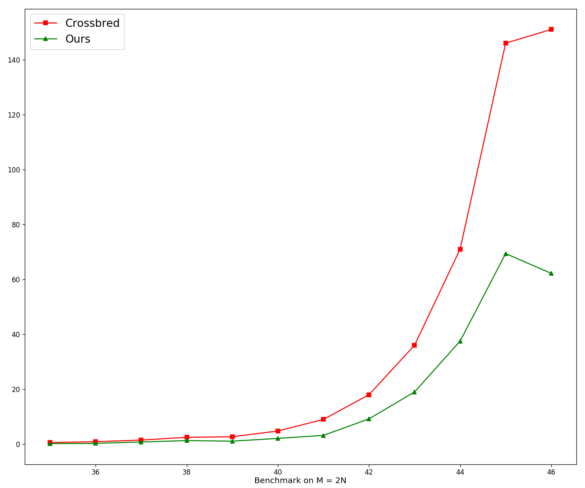

# MQSolver Benchmark

The sample code is based on a MQ problem with setting M=N=46. Moving from sample code to general cases is straightforward if one follows the implementation. The implementation of the benchmark utilizes the Streaming SIMD Extensions (SSE) and the Advanced Vector Extension (AVX). 

We use the identical algorithm but different implementation approaches to solve the MQ challenge. To see our submission, please refer to the website of [Fukuoka MQ Challenge](https://www.mqchallenge.org/).

#### File structure

```bash
Root
|
+-- data
|    |
|    +-- mq46resident.txt            % testing resident file
|    |
|    +-- mq46.txt                    % testing verifying file
+-- exec
|    |
|    +-- mqsolver.cpp                % main executable of mqsolver
+-- include
|    |
|    +-- mqsolver_avx*               
|    |    |
|    |    +-- avx*_intrinsic_ext.h   % extensional functions based on avx* intrinsics
|    |    |
|    |    +-- lin_func.h             % miscellaneous functions related to linear systems over GF2
|    |    |
|    |    +-- mq_arg.h               % miscellaneous functions related to MQ problems
|    +-- param.h                     % MQ problem parameter setup
|    |  
|    +-- utils.h                     % utility functions
+-- src                              % implementation of corresponding header files
|
+-- challenge                        % test files on mq challenge (type 4 n = 55)
|               
+-- cmake
|    |
|    +-- CHECK_AVX512_PRES.cmake     % cmake module to detect the presence of AVX512 intrinsic set
+-- assets
|    |
|    +-- benchmark_m=n.png           % benchmark plot 
|    |
|    +-- benchmark_m=2n.png          % benchmark plot
+-- CMakeLists.txt
```

---

### Requirements

- OS support: Linux
- Software dependence: cmake, build-essentials
- Intrinsic set dependence: sse2, sse3, sse4.1, avx2/avx512

---

### Getting Start

```bash
git clone https://github.com/Vito-Swift/MQSolver_benchmark.git      
cd MQSolver_benchmark
mkdir build
cd build
cmake ..
make
./mqsolver     
```

---

### Comparision between AVX2 and AVX512

| Procedure | AVX2  | AVX512 |
| :-------: | :---: | :-----: |
| Matrix Initialization | :x: | :x: |
| Partial Derivative Initialization | :x: | :x: |
| Extract Linear System | :x: | :heavy_check_mark: |
| Check Consistency of Linear System | :x: | :heavy_check_mark: |
| Extract Solution from Linear System | :x: | :heavy_check_mark: |
| Validate Candidates | :heavy_check_mark: | :heavy_check_mark: |
| Update Graycode and MQ System | :x: | :heavy_check_mark: |

> *:heavy_check_mark: -  SIMD acceleration has been applied in the corresponding procedure.*
>
> *:x: - The corresponding procedure is implemented as ordinary C/C++ code.*

_Note: The host machines are required to be equipped with either AVX2 or AVX512. An artificial cmake module would detect the hardware support of host's architecture and automatically select whether build the project on AVX2 or AVX512. If the host machine does not support AVX512, the mq solver would built on AVX2 by default._

___Be aware that we did not use AVX2 SIMD instrinsic to optimize the Guassian Elimination part in the AVX2 version. AVX2 version is given only to test the feasibility of our algorithm, and the execution time might be much higher due to intrinsic set limits. One is highly recommended to use AVX512 version to obtain the maximal performance.___

---

### Benchmark
#### Testing Environment

- Operating System: Ubuntu 18.04-lts
- CPU: Intel® Core™ i9-7900X X-series Processor 3.30 GHz
- RAM: 32 GB
- Buildup Mode: AVX512

#### Result

The execution time is being calculated after exploring the full search space. 

In normal cases, the computation time would exponentially decrease if N decreases. It is worthwhile to mention that for M = 2N, the computation time of N=45 is slightly larger than N=46, which is because the equation number of linear system is larger than 16 bits, and thus one mm512i register can keep half the number of columns of the linear systems simultaneously. The increment is mainly caused by implementation, not by the theory. 

| Number of variables | M = N | M = 2N |
| :-----------------: | :---: | :----: |
|         35          |  1s   |  0.2s  |
|         36          | 1.7s  |  0.3s  |
|         37          | 3.4s  |  0.8s  |
|         38          | 6.7s  |  1.3s  |
|         39          | 13.5s |  1.1s  |
|         40          | 23.7s |  2.1s  |
|         41          |  40s  | 3.2s   |
|         42          |  84s  | 9.2s   |
|         43          | 163s  | 19s    |
|         44          | 298s  | 37.5s  |
|         45          | 434s  | 69.4s  |
|         46          | 968s  | 62.2s  |

**Comparision between State-of-art and Ours**

| | |
| :---:| :---: |
| |  |

#### Upcoming Work

- Implementation on CUDA
- Implementation on FPGA
- Attempts on Larger Challenges
